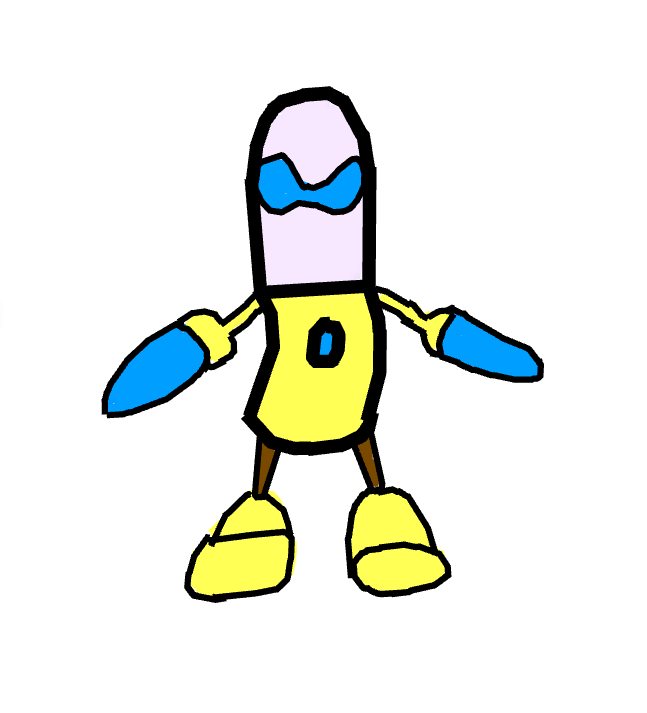

# Lincoln's Page

## Latest
### June 28, 2021
NEW MUSIC! 

[mafrfi (Make a f-ing Run for it!)](/sounds/mafrfi.m4a)
<audio controls>
<source src="./sounds/mafrfi.m4a" type="audio/mpeg">
</audio>

[Radiation](/sounds/Radiation.m4a)
<audio controls>
<source src="./sounds/Radiation.m4a" type="audio/mpeg">
</audio>

[KAB00M](/sounds/KAB00M.m4a)
<audio controls>
<source src="./sounds/KAB00M.m4a" type="audio/mpeg">
</audio>

[DEAD_CLOWN](/sounds/DEAD_CLOWN.m4a)
<audio controls>
<source src="./sounds/DEAD_CLOWN.m4a" type="audio/mpeg">
</audio>

[Latte](/sounds/Latte.m4a)
<audio controls>
<source src="./sounds/Latte.m4a" type="audio/mpeg">
</audio>

[love_at_first_sight](/sounds/love_at_first_sight.m4a)
<audio controls>
<source src="./sounds/love_at_first_sight.m4a" type="audio/mpeg">
</audio>

[POWER_WEAPON](/sounds/POWER_WEAPON.m4a)
<audio controls>
<source src="./sounds/POWER_WEAPON.m4a" type="audio/mpeg">
</audio>

[RELOAD](/sounds/RELOAD.m4a)
<audio controls>
<source src="./sounds/RELOAD.m4a" type="audio/mpeg">
</audio>


### June 15, 2021
[NUKEZ](/sounds/NUKEZ.m4a)
<audio controls>
<source src="./sounds/NUKEZ.m4a" type="audio/mpeg">
</audio>

[lasertag](/sounds/lasertag.m4a)
<audio controls>
<source src="./sounds/lasertag.m4a" type="audio/mpeg">
</audio>


[menumusic](/sounds/menumusic.m4a)
<audio controls>
<source src="./sounds/menumusic.m4a" type="audio/mpeg">
</audio>
  
### May 28, 2021




### Oct 28, 2020

[Ballora Gallery #sisterlocation](https://scratch.mit.edu/projects/441926082/embed)


### Mar 31, 2020
#### Made with Scratch! See the whole thing here: 

[Interview With a Ghost](https://scratch.mit.edu/projects/381384076/)


### Mar 12, 2020
#### Pixel Dad!


### Mar 11, 2020
#### How to draw Video Game Duck

[Video Game Duck](https://docs.google.com/presentation/d/e/2PACX-1vStErkQqHgAFW8_kSAbKELhakW0YfRjUxbgHYfJFuhDmYoneAc-Em0PrAg_Eq9mBYKEkzfM6pkY5HH-/embed?start=false&loop=true&delayms=3000&slide=id.g7e7995037d_0_5) 

### Feb 8, 2020
#### Candle Haiku
```
Soothing candle light.

Relax and take a moment

To think about life.
```


### Feb 5, 2020
#### Dorito Haiku

```
Triangle. Yummy.

Seriously, so good, right?

They’re so awesome. Cheese.
```


### Jan 29, 2020
#### Fruits vs Veggies Rap
```
Fruits:
You grow from a plant
I grow from the best
Veggies are disgusting
And we ain’t a mess!

Veggies:
Your apples are too crunchy
Carrots, yum
You’re such a lil’ baby
We healthier than a plum

Fruits:
You barely even taste good.
You barely even rap.
You barely have potassium,
You little piece of scrap!

Veggies:
Fruits like you are kinda lame.
The trash is the last thing you’ll see (see).
We’re strong, buff, really jacked,
And it’s over to Mr. Leek! (leek!)

Mr. Leek:
I’m Mr. Leek and things can happen
Like when kids are called to the house.
But then they look so sad and mournful
Cuz’ they taste you in their mouth.

Fruits:
Ooo, tough words coming from a bad seed.
You’re a dumb plant no one will ever need.
You’re acting like a lil’ baby carrot.
Hope you get fed to a parrot.

END
```

### Jan 29, 2020
#### Burger Haiku
```
Juicy. Delicious.

I need more hamburgers now.

Fries on the side. Yum
```


### Jan 29, 2020
#### Veggie Rap ft. The Healthy Crew 
```
So we back up in the alleyway,
Eating some fruit.
This man comes up to us
Sayin’ “Listen up dude”.

“If ya wanna eat so healthy,
So healthy, so good,
Then ya gonna have to listen here
All up in the hood”.

“A fruit is a disgrace to the wealthy.
And a veggie, man, is way more healthy.”

“I don’t think that’s true.” Shut up, Brian.”
Fruits are the worst, so STOP LYING!!”

“Peas, Carrots, I don’t know, stuff?
Always remember, VEGGIES ARE LOVE!”

“A little fruit would never hurt.”
“Don’t eat that, Brian, you little nerd.”

“Pineapples are spiky,
Apples won’t do.
That’s why we’re healthy!
THE HEALTHY CREW!!”
```
